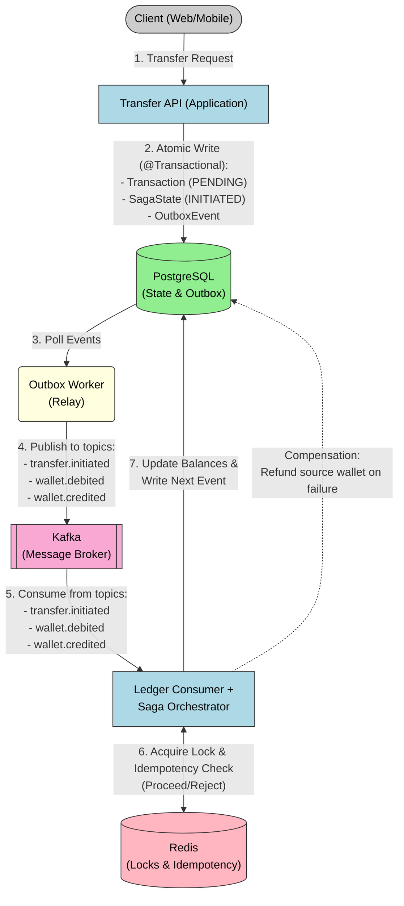

# LedgerFlow

High-performance, event-driven FinTech ledger application demonstrating strict double-entry accounting and distributed systems resilience.

## 🚀 Architecture & Key Features



* **Distributed Transactions (Saga Pattern):** Orchestrates complex multi-wallet transfers safely using Kafka as an event broker.
* **Concurrency Control:** Utilizes PostgreSQL optimistic locking (`@Version`) to completely eliminate double-spend anomalies under heavy load.
* **Idempotency:** Implements Redis-backed distributed locks to ensure messages are processed exactly once, protecting the ledger from network retries.
* **Modern Messaging:** Uses Kafka in KRaft mode (no Zookeeper) for lightweight, high-throughput event streaming.
* **Observability:** Fully integrated Spring Boot Actuator for enterprise-grade health and metrics monitoring.

## 🛠️ Tech Stack

* **Core:** Java 21, Spring Boot 3.x
* **Database & Cache:** PostgreSQL 15, Redis 7
* **Message Broker:** Confluent Kafka 7.4 (KRaft Mode)
* **Testing:** JUnit 5, Testcontainers, Awaitility
* **Infrastructure:** Docker & Docker Compose
* **API Documentation:** Springdoc OpenAPI (Swagger UI)

## ⚡ Quick Start (One-Click Setup)

The entire distributed architecture (API, Database, Cache, and Message Broker) is fully containerized. You do not need to install anything other than Docker.

### 1. Clone the repository

```bash
git clone https://github.com/ayushcodes27/ledger-flow.git
cd ledgerflow
```

### 2. Spin up the infrastructure

```bash
docker-compose up -d
```

> **Note:** This will download the required images and start PostgreSQL, Redis, Kafka, and the LedgerFlow application.

### 3. Verify the deployment

```bash
docker ps
```

## 📖 API Documentation & Monitoring

Once the application is running, you can interact with the API and monitor its health using the built-in dashboards:

| Tool | URL |
|------|-----|
| Swagger UI (Interactive API Docs) | http://localhost:8088/swagger-ui.html |
| Actuator Health Check | http://localhost:8088/actuator/health |

## 🧪 Testing

The project uses Testcontainers to spin up ephemeral Docker containers for PostgreSQL, Redis, and Kafka during integration tests. This ensures tests run in an identical environment to production.

To run the complete test suite, including the high-concurrency stress tests:

```bash
mvn clean test
```

## 📖 API Reference

Here are the core endpoints driving the LedgerFlow system:

| Endpoint | Method | Purpose | Sample Payload | Success Response |
|---|---|---|---|---|
| `/api/v1/wallets` | `POST` | Create a new wallet | Query param: `?currency=USD` | `201 Created` with Wallet ID |
| `/api/v1/transfers` | `POST` | Initiate a money transfer | `{"sourceWalletId": "uuid", "targetWalletId": "uuid", "amount": 50.00}` | `202 Accepted` with Transaction ID |
| `/api/v1/wallets/{id}/ledger` | `GET` | View all immutable ledger entries for a wallet | - | `200 OK` with paginated entries |
| `/api/v1/wallets/{id}/reconcile` | `GET` | Mathematically prove the wallet balance from the ledger | - | `200 OK` with consistency boolean |

*Interactive Swagger UI is available at `http://localhost:8088/swagger-ui.html` when the application is running.*

## 💻 Example Usage (First API Call Walkthrough)

Want to see the Saga pattern in action? Try this sequence in your terminal. Choose the commands matching your operating system/shell:

### 1. Create two wallets

#### Bash / Linux / macOS:
```bash
# Wallet A
curl -X POST "http://localhost:8088/api/v1/wallets?currency=USD"
# Wallet B
curl -X POST "http://localhost:8088/api/v1/wallets?currency=USD"
```

#### Windows PowerShell:
```powershell
# Wallet A
Invoke-RestMethod -Uri "http://localhost:8088/api/v1/wallets?currency=USD" -Method Post
# Wallet B
Invoke-RestMethod -Uri "http://localhost:8088/api/v1/wallets?currency=USD" -Method Post
```
*(Keep note of the UUIDs returned for Wallet A and Wallet B).*

### 2. Fund Wallet A

#### Bash / Linux / macOS:
```bash
curl -X POST http://localhost:8088/api/v1/wallets/<WALLET_A_ID>/credit \
  -H "Content-Type: application/json" \
  -H "Idempotency-Key: unique-key-1" \
  -d '{"amount": 1000.00}'
```

#### Windows PowerShell:
```powershell
Invoke-RestMethod -Uri "http://localhost:8088/api/v1/wallets/<WALLET_A_ID>/credit" \
  -Method Post \
  -Headers @{"Idempotency-Key"="unique-key-1"} \
  -ContentType "application/json" \
  -Body '{"amount": 1000.00}'
```

### 3. Initiate a Distributed Transfer (Wallet A -> Wallet B)

#### Bash / Linux / macOS:
```bash
curl -X POST http://localhost:8088/api/v1/transfers \
  -H "Content-Type: application/json" \
  -d '{
    "sourceWalletId": "<WALLET_A_ID>",
    "targetWalletId": "<WALLET_B_ID>",
    "amount": 250.00
  }'
```

#### Windows PowerShell:
```powershell
Invoke-RestMethod -Uri "http://localhost:8088/api/v1/transfers" \
  -Method Post \
  -ContentType "application/json" \
  -Body '{"sourceWalletId": "<WALLET_A_ID>", "targetWalletId": "<WALLET_B_ID>", "amount": 250.00}'
```

### 4. Check the Ledger (Double-Entry Log)

#### Bash / Linux / macOS:
```bash
curl http://localhost:8088/api/v1/wallets/<WALLET_A_ID>/ledger
curl http://localhost:8088/api/v1/wallets/<WALLET_B_ID>/ledger
```

#### Windows PowerShell:
```powershell
Invoke-RestMethod -Uri "http://localhost:8088/api/v1/wallets/<WALLET_A_ID>/ledger"
Invoke-RestMethod -Uri "http://localhost:8088/api/v1/wallets/<WALLET_B_ID>/ledger"
```


## 🏗️ Design Decisions & Patterns

LedgerFlow solves complex distributed systems challenges using industry-standard patterns:

*   **Saga Pattern:** Multi-wallet transfers are broken down into discrete steps (Debit → Credit). If the target wallet credit fails, the system executes a compensating transaction (a refund back to the source) to maintain eventual consistency.
*   **Transactional Outbox Pattern:** To avoid unreliable two-phase commits (2PC), database state changes and Kafka events are written to PostgreSQL in a single atomic transaction. A background relay ensures the outbox events are published to Kafka with "at-least-once" guarantees.
*   **Double-Spend Prevention (Optimistic & Distributed Locks):** Prevents race conditions using a two-tier approach. Redis `RLock` serializes concurrent requests for the same wallet, while PostgreSQL `@Version` optimistic locking acts as the ultimate source of truth, aborting overlapping transactions.
*   **Idempotent Consumer:** Kafka guarantees at-least-once delivery, which can result in duplicate messages. The consumer uses a Redis `SETNX` lock (`IdempotencyService`) alongside database idempotency keys to guarantee that a transfer step is executed exactly once.

## 📂 Project Structure

```text
src/main/java/com/project/ledgerflow/
├── config/         # App, Kafka, OpenAPI, and Redis configurations
├── consumer/       # Kafka event listeners (LedgerEventConsumer)
├── controller/     # REST API endpoints
├── dto/            # Data Transfer Objects
├── entity/         # JPA Entities (Wallet, Transaction, SagaState, LedgerEntry, OutboxEvent)
├── exception/      # Global exception handling
├── repository/     # Spring Data JPA repositories
├── scheduler/      # Scheduled background jobs (OutboxRelayJob)
└── service/        # Core business logic & Saga Orchestration
```

## 🛠️ Running Locally (Hybrid Mode)

If you want to run the infrastructure via Docker but run the Spring Boot application from your IDE (for debugging):

**1. Start only the infrastructure (PostgreSQL, Redis, Kafka):**
```bash
docker-compose up -d postgres redis kafka
```

**2. Configure your local application environment:**
Ensure your IDE or local `application.yaml` points to the correct ports (they are exposed to localhost in `docker-compose.yml`):
*   Database: `jdbc:postgresql://localhost:5454/mini_wallet`
*   Kafka: `localhost:9092`
*   Redis: `localhost:6379`

**3. Run the Spring Boot App:**
Run `LedgerFlowApplication` directly from your IDE or via Maven:
```bash
./mvnw spring-boot:run
```

## ⚠️ Known Limitations & Roadmap

#### Current Limitations
*   **Authentication & Authorization:** No security layer implemented; API is publicly accessible.
*   **Multi-Currency:** Wallets have a currency, but cross-currency transfers (exchange rates) are not supported.
*   **Kafka HA:** Runs single-node Kafka in KRaft mode (not meant for production high availability).
*   **Observability:** Exposes Actuator metrics, but lacks distributed tracing (OpenTelemetry) or Prometheus/Grafana dashboards.

#### Roadmap
- [ ] Implement Spring Security (JWT) for wallet ownership authorization.
- [ ] Replace polling outbox relay with a Change Data Capture (CDC) tool like Debezium.
- [ ] Add Dead Letter Queues (DLQ) for permanent event processing failures.
- [ ] Add `GET /transfers/{id}` endpoint to track real-time saga status.
- [ ] Migrate database schema management to Flyway or Liquibase.